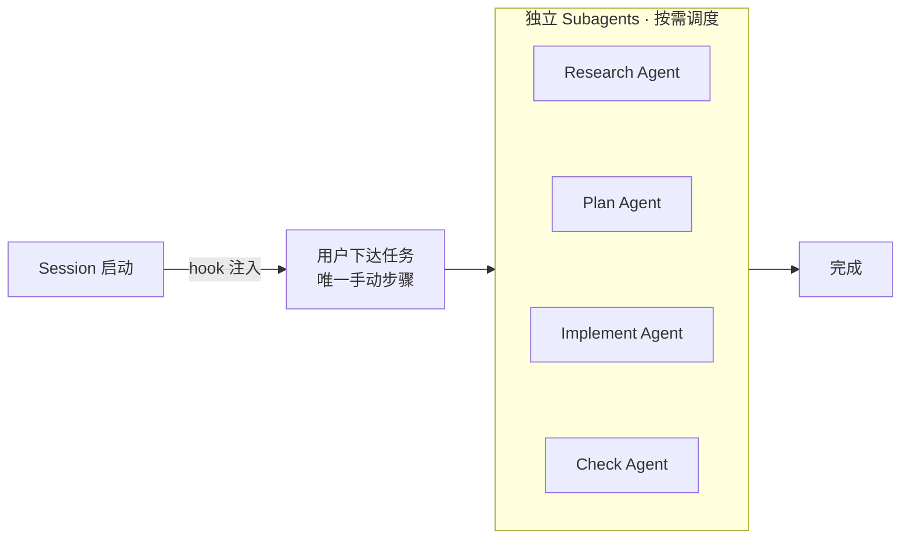

# Trellis

**Claude Code / Cursor 的 AI 工作流框架**

> Wild AI ships nothing.

[English](./README.md) | 中文

<!-- TODO: Hero GIF -->

---

## Why Trellis?

| 功能 | 说明 |
|------|------|
| **自动注入** | 规范和工作流写一次，以后每次对话自动生效 |
| **规范库** | 沉淀最佳实践，经验教训不再遗忘 |
| **多 Session 并行** | 任务在后台执行，你可以继续做别的 |
| **自我迭代** | AI 自动更新规范，越用越好 |
| **团队共享** | 团队共享规范和工作流，一人总结的最佳实践，全队受益 |
| **Session 持久化** | 工作痕迹记录到 journal，AI 记得项目历史，不用重复解释 |

---

## Quick Start

```bash
# 1. 安装
npm install -g @mindfoldhq/trellis@latest

# 2. 初始化项目
cd your-project
trellis init -u your-name

# 3. 打开 Claude Code，开始用
```

`-u` 是你的标识，用于创建个人工作区 `.trellis/workspace/your-name/`。

---

## Use Cases

### 添加规范

```
你:  我们用 Zustand，禁止 Redux。加到规范里。

AI:  已添加到 .trellis/spec/frontend/state-management.md
```

### 下次对话自动遵守

```
你:  添加一个用户偏好的 store

AI:  ┌─ Research ─────────────────────────┐
     │ ✓ Found: state-management.md       │
     │ → 规范要求: 使用 Zustand           │
     └────────────────────────────────────┘

     创建 src/stores/userPreferences.ts (Zustand)
     ✓ lint 通过
```

### 复杂任务：/parallel

```
你:  /parallel 做一个用户认证系统

AI:  [Plan]   分析代码库，写 PRD
     [Implement] 在独立 worktree 写代码
     [Check]  验证是否符合规范
     [PR]     创建 Pull Request

     → https://github.com/you/repo/pull/42
```

---

## How It Works

### 项目结构

```
.trellis/
├── workflow.md              # 工作流指南（Session 启动时自动注入）
├── worktree.yaml            # 多 Agent 配置（/parallel 用）
├── spec/                    # 规范库
│   ├── frontend/            #   前端规范 + index.md
│   ├── backend/             #   后端规范 + index.md
│   └── guides/              #   决策和分析框架
├── workspace/{name}/        # 个人工作区（journal、偏好）
├── tasks/                   # 任务管理（状态、负责人、关注人、PRD）
└── scripts/                 # 脚本工具

.claude/
├── settings.json            # Hook 配置
├── agents/                  # Agent 定义
│   ├── dispatch.md          #   调度器（纯分发，不读规范）
│   ├── implement.md         #   实现 Agent
│   ├── check.md             #   检查 Agent
│   └── research.md          #   研究 Agent
├── commands/                # Slash 命令（/parallel, /finish-work 等）
└── hooks/                   # Hook 脚本
    ├── session-start.py     #   启动时注入上下文
    ├── inject-subagent-context.py  # 子 Agent 调用时注入规范
    └── ralph-loop.py        #   Check Agent 不通过就重试
```

### Hook 机制

| Hook | 触发时机 | 做什么 |
|------|---------|--------|
| **session-start** | 新 Session 打开 | 注入 workflow.md + 规范索引 + 当前任务状态 |
| **inject-subagent-context** | 调用子 Agent 前 | 从 task.jsonl 读取需要的规范文件，注入到 Agent |
| **ralph-loop** | Check Agent 想结束时 | 验证不通过就阻止结束，强制重试（最多 5 次） |

### 工作流



详细架构见 [工程文档](./docs/README.md)。

---

## FAQ

**Q: 为什么用 Trellis 而不是 Skill？**

Skill 是可选的，用户可以跳过，质量无法保证。Trellis 通过 Hook 强制注入规范：不是"可以用"而是"必定生效"。把随机性变成确定性，确保质量不会随时间劣化。

**Q: "Wild AI ships nothing" 什么意思？**

不加约束的 AI 写不出能上线的代码。Trellis 给 AI 加上项目规范和工作流约束。

**Q: 安装后第一步做什么？**

直接打开 Claude Code 对话。Hook 会自动注入上下文，你会看到 AI 读取了 workflow.md。然后正常聊天即可。

**Q: 规范文件是手动写还是让 AI 创建？**

大部分情况 AI 能搞定——说一句"我们用 Zustand，禁止 Redux"，它会自动创建规范文件。但当你有 AI 自己悟不出的架构洞察时，就该你出手了。把团队踩过的坑、积累的经验教给 AI——这就是为什么你不会因为 AI 而失业。

**Q: 和 .cursorrules / CLAUDE.md / AGENTS.md 有什么区别？**

它们都是 all-in-one 文件，AI 每次都要读全部内容。Trellis 采用分层架构 + 上下文压缩：只加载当前任务相关的规范。工程规范应该优雅分层，而不是一锅炖。

**Q: 多人同时用会冲突吗？**

不会。每人有独立工作区 `.trellis/workspace/{name}/`，规范文件是共享的（提交到 Git）。

**Q: Hook 出错怎么调试？**

看 Claude Code 的日志。Hook 脚本在 `.claude/hooks/` 目录，可以直接运行测试。

**Q: Cursor 能用吗？**

能。安装时同时配置 `.cursor/` 目录。

---

## Roadmap

- **更完善的 Code Review** — 更彻底的自动化审查流程
- **Skill 预设包** — 预置工作流包，即插即用
- **更广泛的 IDE 支持** — Cursor、OpenCode、Codex 集成
- **更强的 Session 连续性** — 自动保存聊天记录，下次接着聊
- **可视化并行 Session** — CLI 借助 tmux 自动分窗口，实时查看每个 Agent 进度

---

## 链接

- [完整文档](./docs/README.md)
- [GitHub Issues](https://github.com/mindfold-ai/Trellis/issues)

---

MIT 许可证 • [Mindfold](https://mindfold.ai)
