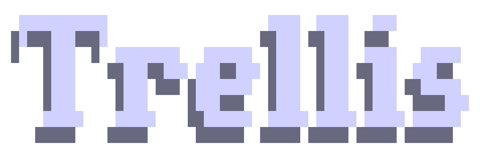
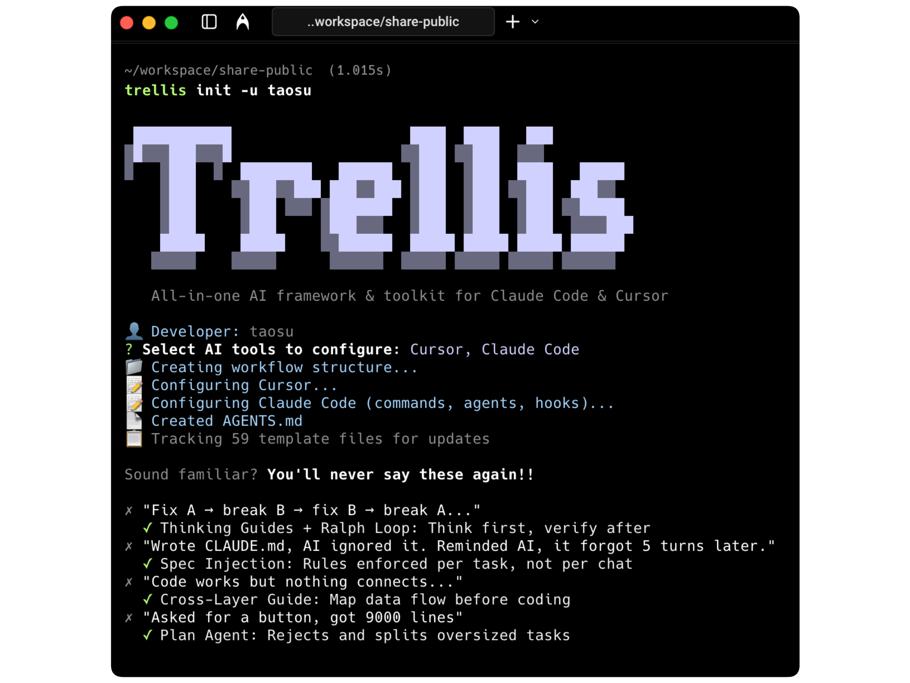

<!--<p align="center">
  
</p>-->

<p align="center">
  <picture>
    <source srcset="assets/trellis.png" media="(prefers-color-scheme: dark)">
    <source srcset="assets/trellis.png" media="(prefers-color-scheme: light)">
    
  </picture>
</p>

<p align="center">
  <strong>All-in-one AI framework & toolkit for Claude Code & Cursor</strong><br/>
  <sub>Wild AI ships nothing.</sub>
</p>

<p align="center">
  <a href="https://www.npmjs.com/package/@mindfoldhq/trellis"></a>
  <a href="https://github.com/mindfold-ai/Trellis/blob/main/LICENSE"></a>
  <a href="https://github.com/mindfold-ai/Trellis/stargazers"></a>
  <a href="https://discord.gg/trellis"></a>
</p>

<p align="center">
  <a href="#-quick-start">Quick Start</a> •
  <a href="#-why-trellis">Why Trellis</a> •
  <a href="#-use-cases">Use Cases</a> •
  <a href="#-how-it-works">How It Works</a> •
  <a href="#-faq">FAQ</a>
</p>

## Why Trellis?

| Feature | Problem Solved |
| --- | --- |
| **Auto-Injection** | Write specs and workflow once, auto-loaded in every conversation |
| **Spec Library** | Codify best practices — lessons learned won't be forgotten |
| **Multi-Session Parallel** | Run tasks in background worktree, keep working on other things |
| **Self-Iteration** | Learns from every task: updates specs automatically |
| **Team Sharing** | One person's best practice benefits everyone |
| **Session Persistence** | AI remembers project history — no re-explaining |


## Quick Start

```bash
# 1. Install
npm install -g @mindfoldhq/trellis@latest

# 2. Initialize project
cd your-project
trellis init -u your-name

# 3. Open Claude Code — start using immediately
```

> `-u` creates your personal workspace at `.trellis/workspace/your-name/`

<p align="center">
  
</p>

## Use Cases

### Teaching AI your standards

```
You: We use Zustand, no Redux. Add this to specs.

AI:  Added to .trellis/spec/frontend/state-management.md
```

Next conversation, AI follows automatically:

```
You: Add a user preferences store

AI:  ┌─ Research ─────────────────────────┐
     │ ✓ Found: state-management.md       │
     │ → Spec requires: Use Zustand       │
     └────────────────────────────────────┘

     Created src/stores/userPreferences.ts (Zustand)
     ✓ lint passed
```

### Complex tasks with `/parallel`

```
You: /parallel build a user auth system

AI:  [Plan]      Analyze codebase, write PRD
     [Implement] Write code in isolated worktree
     [Check]     Verify against specs
     [PR]        Create Pull Request

     → https://github.com/you/repo/pull/42
```

## How It Works

### Project Structure

```
.trellis/
├── workflow.md              # Workflow guide (auto-injected on start)
├── worktree.yaml            # Multi-agent config (for /parallel)
├── spec/                    # Spec library
│   ├── frontend/            #   Frontend specs
│   ├── backend/             #   Backend specs
│   └── guides/              #   Decision frameworks
├── workspace/{name}/        # Personal journal
├── tasks/                   # Task management
└── scripts/                 # Utilities

.claude/
├── settings.json            # Hook configuration
├── agents/                  # Agent definitions
│   ├── dispatch.md          #   Dispatcher
│   ├── implement.md         #   Implement Agent
│   ├── check.md             #   Check Agent
│   └── research.md          #   Research Agent
├── commands/                # Slash commands
└── hooks/                   # Hook scripts
    ├── session-start.py     #   Inject context on startup
    ├── inject-subagent-context.py
    └── ralph-loop.py        #   Quality control loop
```

### Workflow Diagram

<p align="center">
  
</p>


## Roadmap

- [ ] **Better Code Review** — More thorough automated review workflow
- [ ] **Skill Packs** — Pre-built workflow packs, plug and play
- [ ] **Broader IDE Support** — Cursor, OpenCode, Codex integration
- [ ] **Stronger Session Continuity** — Auto-save chat history
- [ ] **Visual Parallel Sessions** — tmux auto-split, real-time progress


## FAQ

<details>
<summary><strong>Why Trellis instead of Skills?</strong></summary>

Skills are optional — AI may skip them, leading to inconsistent quality. Trellis **enforces** specs via Hook injection: not "can use" but "always applied". This turns randomness into determinism.

</details>

<details>
<summary><strong>Do I write spec files manually?</strong></summary>

Most of the time, AI handles it — just say "We use Zustand, no Redux" and it creates the spec file automatically. But when you have architectural insights AI can't figure out on its own, that's where you step in. Teaching AI your team's hard-won lessons — that's why you won't lose your job to AI.

</details>

<details>
<summary><strong>How is this different from CLAUDE.md / .cursorrules?</strong></summary>

Those are all-in-one files — AI reads everything every time. Trellis uses **layered architecture** with context compression: only loads relevant specs for current task. Engineering standards should be elegantly layered, not monolithic.

</details>

<details>
<summary><strong>Will multiple people conflict?</strong></summary>

No. Each person has their own space at `.trellis/workspace/{name}/`. Spec files are shared and committed to Git.

</details>

## Community

- [Discord](https://discord.gg/trellis) — Join the conversation
- [GitHub Issues](https://github.com/mindfold-ai/Trellis/issues) — Report bugs & request features

<p align="center">
  <a href="https://github.com/mindfold-ai/Trellis/blob/main/LICENSE">FSL License</a> •
  Made with care by Mindfold</a>
</p>

<p align="center">
  <sub>Found Trellis useful? Please consider giving it a ⭐</sub>
</p>
